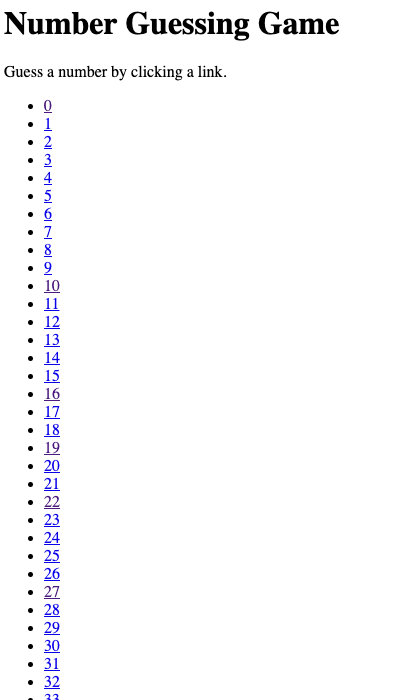

# Guess My Number: Flask

For this mini-project, you'll build a small Flask app that implements the number
guessing game from your [previous project](https://github.com/kiboschool/guess-my-number).

The goal is to practice with the basics of Flask: routes and templates.

## Features

- index page should tell the user about the game, and have a link to start the
    game
- When they click to start the game, the user should be shown a page with 
- numbers to guess
- When they click a number, the app should tell them if the number was correct,
    too high, or too low, and show a link back to guess again

This is what the page of numbers to guess should look like:



## Notes

- All the routes should use the HTTP GET method (no POST or other kinds of
requests for now)
- Don't be afraid to copy/paste code from index.html to your other template
    files as you get started

## Starter Code

There is an app.py file that renders the index.html template file.

You should write more routes in app.py and create additional template files for
the other pages of the application.

Start the development app by running:

```sh
flask run
```

## Testing

You should run your app and check that behaves as expected by trying the game in
the browser.

## Bonus

This is intended to be a simple project to make sure you know the basics of
routing and templates. If you have more time and want to experiment, you can
also:

- add a stylesheet and a favicon (refer to the material about serving static files)
- try using a form instead of just links for the number guessing game

If you complete the bonus tasks, you should still submit a version of the
project that works using links, not a form.
